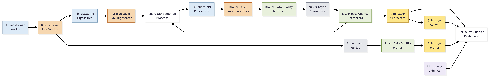

# Tibia Analytics

Data engineering project focused on building a historical analytics platform to measure Tibia community health through character activity, retention, and population trends.

## Table of Contents

- [Overview](#overview)
- [Data Scope](#data-scope)
- [Analytical Questions](#analytical-questions)
- [Architecture](#architecture)
  - [Data Flow](#data-flow)
  - [Medallion Layers](#medallion-layers)
- [Dataset Scale](#dataset-scale)
- [Design Decisions](#design-decisions)
  - [Data Modeling](#data-modeling)
  - [Analytical Modeling](#analytical-modeling)
  - [Platform and Tooling](#platform-and-tooling)
- [Dashboard](#dashboard)
  - [Overview](#overview-1)
  - [Retention](#retention)
  - [Long-Term Health](#long-term-health)
- [Data Quality](#data-quality)
- [Deployment](#deployment)
- [Current Limitations](#current-limitations)
- [Future Improvements](#future-improvements)
- [License](#license)

## Overview 

[Tibia](https://www.tibia.com) is a long-running MMORPG composed of dozens of independent game worlds, each with its own player population and activity patterns.

This project builds a historical analytics platform to analyze the long-term health of Tibia communities by tracking the activity of characters over time, using last login behavior as the main signal for character activity. Characters are discovered through the Experience Highscores ranking and monitored through daily snapshots, even after they leave the ranking.

The goal is not to analyze individual characters, but to understand collective behavior across worlds and identify changes in community activity, retention, and engagement over time. Data is collected through the [TibiaData](https://tibiadata.com/) API, processed through a Medallion Architecture (Bronze → Silver → Gold), and exposed through analytical datasets and a [Databricks Lakeview](https://docs.databricks.com/en/dashboards/) dashboard.

## Data Scope

### Why Experience Highscores?

The project uses the Experience Highscores as the primary source for character discovery. Level progression in Tibia requires sustained activity over time, making the ranking a practical way to identify characters that are currently active across different worlds. However, the ranking is only used for discovery. Once a character is identified, it becomes part of the historical dataset and continues to be tracked through daily snapshots, even if it is no longer present in the ranking. This approach allows the analysis to capture not only active characters, but also inactivity periods, churn patterns, and reactivation patterns over time.

The goal is not to reconstruct the entire Tibia character universe, but to maintain a consistent historical view of characters observed through the ranking and analyze how communities evolve over time.

### Character Discovery Strategy

Character data is collected through individual character requests generated from the Experience Highscores of every monitored world. The pipeline follows an incremental discovery approach, where each execution combines newly observed character names from Bronze Highscores with the existing tracked population maintained in Silver Characters. API requests are performed using the current character name available at ingestion time, while historical names and previous states are handled separately by the identity resolution layer. This separation keeps ingestion focused on collecting the latest available source data while allowing the Silver layer to resolve whether different observations represent the same historical character.

The ingestion layer also includes safeguards to prevent invalid upstream states from propagating through the pipeline. For example, Highscores ingestion validates that valid world data is available before requesting downstream API endpoints. API requests also include retry and error-handling logic for transient failures such as rate limiting and temporary service interruptions.

## Analytical Questions

The platform supports analytical questions such as:

- How is the active character population evolving across worlds over time?
- Which worlds are growing, stable, or in decline?
- What share of the population is new, returning, dormant, or churned in a given period?
- How do lifecycle event rates — new arrivals, churn, reactivation — shift over time?
- How do retention patterns differ across worlds, vocations, and character cohorts?

## Architecture

The project follows a Databricks-based Medallion architecture designed to separate raw data ingestion, historical modeling, and analytical consumption. Data flows through Bronze, Silver, and Gold layers, where each layer has a specific responsibility: preserving source data, creating reliable historical entities, and providing optimized datasets for analytics and dashboards.

### Data Flow

The pipeline follows a dependency chain where world metadata enables highscores collection, highscores drive character discovery, and character snapshots are transformed into historical analytical datasets.

<p align="center">
  
</p>

_**¹** Character ingestion combines newly discovered characters from Bronze Highscores with the existing tracked population from Silver Characters._

### Medallion Layers

#### Bronze

Stores raw API responses in Delta tables partitioned by ingestion date. No transformations are applied. The goal is to preserve an auditable and replayable record of the source data.

#### Silver

Applies cleaning, typing, deduplication, and identity resolution. Incremental transformations use MERGE operations to maintain curated entities, while deterministic window functions select the correct record version when multiple observations exist. Character identity resolution handles name changes and historical continuity (see [Design Decisions](#design-decisions)). Silver tables serve as the authoritative curated layer for each domain.

#### Gold

Provides analytical datasets used by the dashboard and other analytical workloads. Character behavior is pre-aggregated at multiple time granularities (Day, Week, Month, Quarter), while cohort retention is precomputed to support interactive analysis. World metadata is maintained as a slowly changing dimension.

## Dataset Scale

### Overview

| Metric                    | Value       |
|---------------------------|-------------|
| Worlds monitored          | 90+         |
| Unique characters tracked | 105k+       |
| Total historical rows     | 12M+        |
| Data size                 | 5GB+        |
| Daily pipeline runtime    | ~75 min ¹   |
| Daily rows ingested       | 105k+       |

_**¹** ~60 minutes are spent on character ingestion, constrained by a rate limit of 32 requests/second._

## Design Decisions

### Data Modeling

#### Character Identity Resolution

##### Problem

The TibiaData API provides access to publicly available character data from Tibia.com, but the available data does not include a stable character identifier that can be used as a historical key. Because of this limitation, the platform needs to create and maintain its own identity resolution layer to track characters consistently over time.

Character identity is inferred from observable attributes rather than a permanent source identifier. Characters may change names, transfer between worlds, become temporarily unavailable due to incomplete or partially updated source data, and later appear again in subsequent observations. The API also provides historical attributes such as `former_names` and `former_worlds`, but these fields have limited retention and may not always contain enough information at the time of ingestion. Without identity resolution, the same character could appear as multiple entities over time, breaking retention, lifecycle, and behavioral analysis.

##### Decision

The Silver layer uses a two-table identity model:

- `characters_identity` maintains a stable character_id for each character.
- `characters_state` tracks observed identities over time, including current names, historical names, and inferred historical states.

Identity resolution combines current observations, API-provided history (`former_names` and `former_worlds`), and historical snapshots collected by the platform to maintain continuity even when source data is delayed or incomplete.

##### Outcome

Historical observations remain linked to a single character identifier across name changes, world transfers, and other identity transitions, providing a stable foundation for longitudinal analysis.

### Analytical Modeling

#### Lifecycle Classification

##### Problem

Understanding community health requires more than measuring population size. Characters need to be classified based on their activity behavior over time to identify patterns such as new arrivals, returning characters, dormant characters, and churn.

##### Decision

Lifecycle states and events are calculated from historical character observations using last login behavior and activity continuity rules. These classifications are stored in the Gold layer and used by analytical models and dashboard views.

##### Outcome

The dashboard can analyze community evolution through consistent lifecycle metrics instead of requiring each analysis to recreate the classification logic.

#### Multi-Granularity Behavior Aggregation

##### Problem

Character activity is collected daily. Running retention, lifecycle, and population analysis directly from daily snapshots would increase query complexity and require repeated aggregation logic across analytical workloads.

##### Decision

Daily observations are aggregated into a periodic dataset covering Day, Week, Month, and Quarter granularities. The model stores activity indicators, lifecycle classifications, progression metrics, and other analytical attributes at the selected period level. Periods are classified as `complete`, `partial_start`, `partial_current`, or `partial_missing` to distinguish fully observed periods from incomplete observations.

##### Outcome

Dashboard queries can read from a single pre-aggregated dataset instead of repeatedly scanning the full historical snapshot table, keeping analytical workloads simpler as the dataset grows.

#### Precomputed Cohort Retention

##### Problem

Retention analysis requires comparing each cohort against future observation periods. As historical data grows, calculating these metrics dynamically becomes increasingly expensive.

##### Decision

The `cohort_retention` table precomputes retention metrics for every cohort period, observation period, and supported granularity.

##### Outcome

The dashboard can retrieve retention curves directly from the analytical layer instead of recalculating cohort relationships during each query execution.

### Platform and Tooling

#### Unified Databricks Platform

The project was intentionally built entirely within Databricks. For the current scope, Databricks provides orchestration, storage, processing, governance, and visualization in a single platform, reducing operational complexity while keeping the architecture easy to maintain.

#### SQL-First Transformations

Transformations are written in SQL across all three layers. The pipeline uses MERGE for idempotent upserts, QUALIFY with window functions for deduplication, and BROADCAST hints in some enrichment joins when needed. Keeping everything in SQL makes the logic easier to read and lets you run and inspect queries directly in Databricks without switching to Python.

## Dashboard

The Community Health dashboard provides a pre-built analytical view over the Gold layer, organized into six sections: Overview, Lifecycle, Engagement, Retention, Long-Term Health, and Data Quality & Audit. It focuses on aggregated community-level behavior across worlds rather than analyzing individual characters. The screenshots below show a sample of the dashboard and some of its main analytical views. They are provided as examples and do not cover every available page or visualization.

### Overview

Tracks active population size across all monitored worlds over time, with activity breakdowns by 7-day, 30-day, and 90-day windows and period-over-period change indicators.

<p align="center">
  
</p>

### Retention

Shows cohort-based retention rates across multiple time granularities (weekly, monthly, quarterly), allowing comparison of retention patterns across different cohorts at equivalent observation windows.

<p align="center">
  
</p>

### Long-Term Health

Surfaces longitudinal indicators — new character arrivals, churn rates, and reactivation trends — to evaluate long-term health trends across worlds.

<p align="center">
  
</p>

The remaining sections — Lifecycle, Engagement, and Data Quality & Audit — cover character lifecycle transitions, engagement depth indicators, and pipeline coverage metrics respectively.

## Data Quality

Each daily run produces coverage metrics per period, including `total_characters`, `missing_period_rate`, and `coverage_ratio`. These values are used to identify incomplete ingestion windows, while period tables include a `period_status` field (`complete`, `partial_start`, `partial_current`, `partial_missing`) so downstream queries can handle incomplete observations without additional logic. The results are exposed in the Data Quality & Audit dashboard section to monitor pipeline coverage and identify ingestion gaps.

The pipeline also includes validation checks across Bronze and Silver layers to prevent inconsistent data from reaching analytical tables. Critical datasets have dedicated Data Quality tasks in the orchestration workflow, allowing validation failures to stop downstream processing when expected conditions are not met. Identity resolution exceptions are handled through the `character_identity_overrides` table, which allows known cases where automatic matching cannot determine the correct identity to be corrected in a controlled way. Deduplication and record selection are applied throughout the pipeline using deterministic rules such as `QUALIFY ROW_NUMBER()`, ensuring that only the expected record version is propagated when multiple observations exist.

## Deployment

The pipeline is orchestrated through Databricks Jobs, with task dependencies controlling the execution order between ingestion, data quality validation, Silver transformations, and Gold processing. Each step only runs after its upstream dependencies complete successfully, preventing incomplete data from propagating through the pipeline.

### Prerequisites
Before deploying this project, ensure you have:

- A Databricks workspace with Unity Catalog enabled.
- A configured SQL Warehouse.
- The [Databricks CLI](https://docs.databricks.com/en/dev-tools/cli/index.html) (v0.205+) installed and authenticated.
- A Git folder (Databricks Repos) connected to this repository.

### Importing the jobs
This repository includes three Databricks job definitions under `jobs/`:

| File                                    | Description                                         |
|-----------------------------------------|-----------------------------------------------------|
| `tibia_analytics_schema_bootstrap.json` | Creates catalogs, schemas, and all tables           |
| `tibia_analytics_data_ingestion.json`   | Runs the full ingestion and transformation pipeline |
| `tibia_analytics.json`                  | Orchestrator — runs the two jobs above in sequence  |

Jobs must be created in sequence because the orchestrator references the job IDs generated during creation.

#### Via Databricks CLI
Create the dependency jobs first and capture the returned `job_id` values:
```bash
databricks jobs create --json @jobs/tibia_analytics_schema_bootstrap.json
databricks jobs create --json @jobs/tibia_analytics_data_ingestion.json
```
Update the orchestrator configuration with the generated IDs, then create it:
```bash
databricks jobs create --json @jobs/tibia_analytics.json
```

#### Via Databricks UI
Jobs can also be created manually in the Databricks workspace:
- Go to **Jobs & Pipelines**.
- Select **Create** → **Job**. 
- Configure tasks based on the JSON definitions in this repository.

### Required Configuration
Before running the orchestrator, replace the following placeholders in `jobs/tibia_analytics.json`:

| Placeholder                              | Where to find it                                                           |
|------------------------------------------|----------------------------------------------------------------------------|
| `<REPLACE_WITH_YOUR_EMAIL>`              | Email address used for job failure notifications                           |
| `<REPLACE_WITH_SCHEMA_BOOTSTRAP_JOB_ID>` | Job ID returned after creating the schema bootstrap job                    |
| `<REPLACE_WITH_DATA_INGESTION_JOB_ID>`   | Job ID returned after creating the data ingestion job                      |
| `<REPLACE_WITH_QUERY_ID>`                | SQL query ID (visible in the SQL Editor URL under `queries/...`)           |
| `<REPLACE_WITH_WAREHOUSE_ID>`            | SQL Warehouse ID (found in the warehouse connection details)               |

### Schedule

The orchestrator runs daily at **10:30 (Europe/Berlin)**, 30 minutes after the Tibia server save.  
This scheduling avoids execution during maintenance windows and ensures upstream API data is fully available before ingestion starts.

### Notes

The bootstrap job is idempotent and safe to re-run. This project currently uses Databricks CLI for simplicity. For production environments, Databricks recommends [Asset Bundles](https://docs.databricks.com/aws/en/dev-tools/bundles) or [Terraform](https://docs.databricks.com/aws/en/dev-tools/terraform) for CI/CD and environment promotion.

### Exploring the Project

Once the pipeline has run at least once, the Gold layer tables are available in the Unity Catalog under `tibia_analytics.gold`. The easiest entry point is the Databricks SQL editor — `characters_behavior_periodic` and `cohort_retention` are the two main analytical tables. The Community Health dashboard provides a pre-built view across all six analytical sections. For data quality inspection, the queries under `queries/` include audit scripts that report coverage and missing period rates per ingestion date.

## Current Limitations

- Data coverage is limited to the Experience Highscores scope. Characters that never appear in rankings are not included. The focus is on the active character population, not a full historical record of all characters.
- Ingestion runs once per day. Each run captures a daily snapshot per character, which works well for retention and lifecycle analysis but doesn't support intraday or near-real-time queries.
- Identity resolution handles common name changes and world transfers, but there are still edge cases where continuity can break, especially when the source data is incomplete at the time of ingestion.
- The pipeline also depends on the TibiaData API being available and stable. Any changes in endpoints or rate limits would require adjustments in the ingestion process.

## Future Improvements

- Replace the current full refresh pattern in `characters_behavior_periodic` and `cohort_retention` with incremental processing. These tables currently rely on `TRUNCATE + INSERT`, which can leave the target table temporarily incomplete if a pipeline execution fails during processing and prevents partial results from being published as the latest state. 
- Add schema validation at the Bronze layer to detect upstream API changes earlier. New or renamed fields currently depend on downstream transformations failing before the issue becomes visible.
- Introduce Asset Bundles (YAML-based definitions) to replace the current CLI deployment workflow, improving reproducibility and enabling easier promotion across deployment environments.
- Expose curated datasets for external BI consumption, allowing analytical users to connect directly to the Gold layer without depending on the dashboard layer.

## License

Licensed under the MIT License. See the [LICENSE](LICENSE) file for details. Data used in this project comes from publicly available external sources, which may have their own terms and conditions. Tibia Analytics is an independent data analytics project and is not affiliated with or endorsed by [CipSoft](https://www.cipsoft.com).

