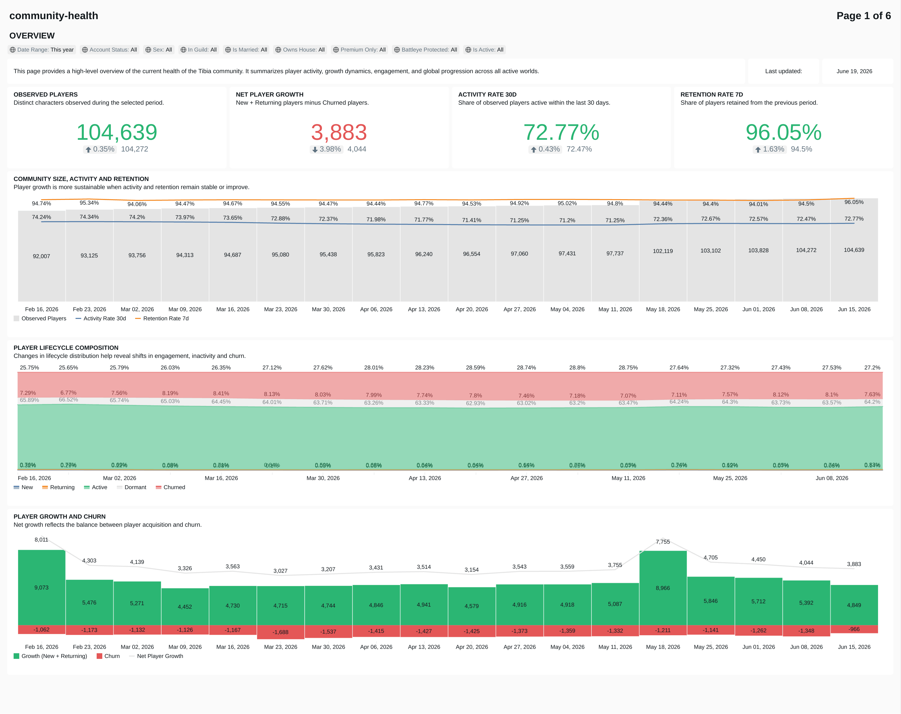
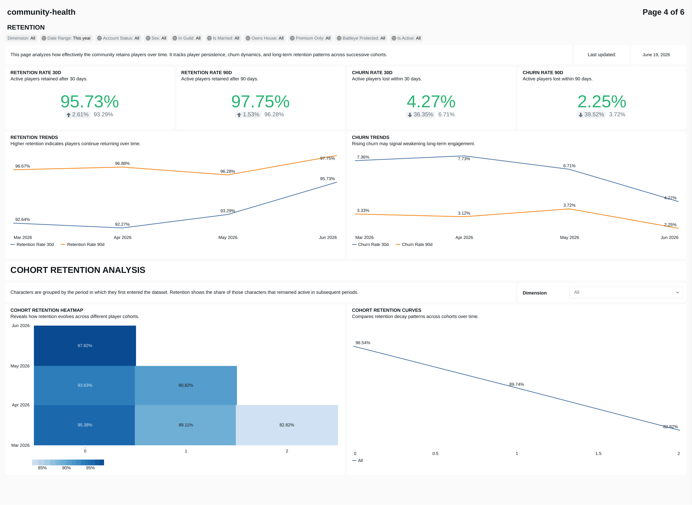
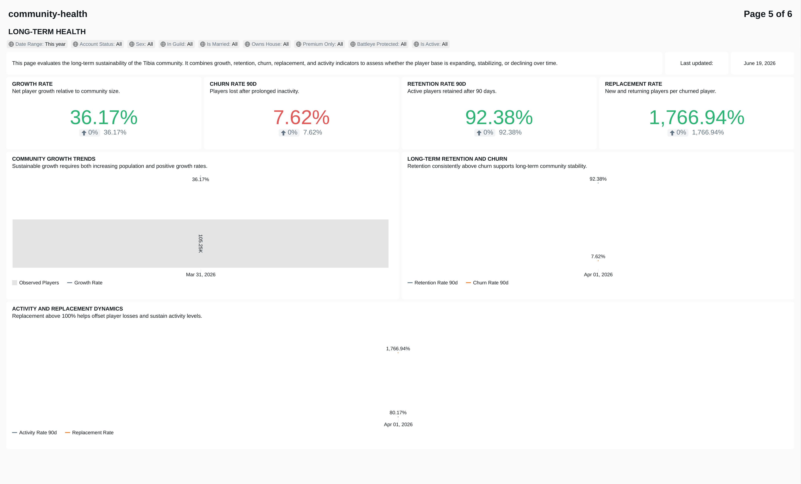

# tibia-analytics

Data engineering project focused on analyzing Tibia communities through player activity, retention, and world population trends.

## Overview

[Tibia](https://www.tibia.com) is a long-running MMORPG composed of dozens of independent game worlds, each with its own player population and activity patterns.

This project builds a data platform on top of the [TibiaData](https://tibiadata.com/) public API to track how those communities evolve over time. The platform captures daily snapshots and transforms them into analytical datasets that support retention analysis, player lifecycle tracking, cohort analysis, and world-level population monitoring.

The project is built on [Databricks](https://www.databricks.com) using [Unity Catalog](https://www.databricks.com/product/unity-catalog) and follows a Medallion Architecture (Bronze → Silver → Gold). Curated datasets are consumed through a [Databricks Lakeview](https://docs.databricks.com/en/dashboards/) dashboard and support longitudinal community analysis.

## Data Scope

### Why Experience Highscores?

The project uses the Experience Highscores as the primary source for character discovery.

Level progression in Tibia requires sustained player activity over time, making the ranking a useful proxy for the active player population. Rather than attempting to track every character ever created, the project focuses on players who demonstrate ongoing engagement with the game.

This approach supports the project's objective of analyzing community behavior, retention, and population trends without requiring exhaustive coverage of all existing characters.

### Why Not Other Highscores?

The TibiaData API exposes character information through individual character endpoints. Expanding the ingestion process to additional rankings would substantially increase the number of API requests while providing limited additional value for the current analytical goals.

The Experience Highscores already provide broad coverage across active players and worlds, making them sufficient for retention, lifecycle, and population analysis.

The data model and ingestion pipeline were designed to be extensible, allowing additional rankings to be incorporated if future analytical requirements justify the added complexity and processing cost.

### API Considerations

Character data is collected through individual character requests derived from the Experience Highscores of every tracked world.

To balance analytical coverage with operational cost, the pipeline limits character discovery to the selected ranking scope and reuses previously discovered characters in subsequent executions. This reduces unnecessary API traffic while continuously expanding the historical dataset over time.

## Analytical Questions

The platform supports analytical questions such as:

### Population Trends

- How is the active player population evolving over time?
- Which worlds are growing, stable, or declining?
- How does player activity vary across different time horizons?

### Player Lifecycle

- What share of the population is new, returning, dormant, or churned?
- How do lifecycle transitions change over time?
- How does the composition of the player base evolve across different segments?

### Retention & Cohorts

- How do player retention rates change across cohorts?
- How do retention patterns differ by world or vocation?
- How do newer cohorts compare to historical cohorts?

## Architecture

<pre>
<b>tibia_analytics</b>................orchestrator, runs daily
├── <b>tibia_analytics_schema_bootstrap</b>
│   ├── Catalogs, Schemas and Volumes
│   ├── Utility tables.....calendar
│   ├── Bronze tables
│   ├── Silver tables
│   └── Gold tables
└── <b>tibia_analytics_data_ingestion</b>
    ├── API ingestion......worlds → highscores → characters
    ├── Bronze layer.......COPY INTO raw tables
    ├── Silver layer.......identity resolution, history, enrichment
    └── Gold layer.........behavior, cohort retention, world aggregates
</pre>

The ingestion pipeline follows a dependency chain where worlds provide the scope for highscore collection, and highscores drive character discovery.

World metadata is ingested first, followed by highscores for each world. Character ingestion combines newly discovered players from highscores with the existing tracked population.

After data is loaded into Bronze, downstream processing runs independently for each domain.

### Medallion Layers

#### Bronze

Stores raw API responses in Delta tables partitioned by ingestion date. No transformations are applied. The goal is to preserve an auditable and replayable record of the source data.

#### Silver

Applies cleaning, typing, deduplication, and identity resolution. Character processing also resolves player identities across name changes over time (see Design Decisions below).

Silver tables serve as the authoritative curated layer for each domain.

#### Gold

Provides analytical datasets used by the dashboard and other analytical workloads. Character behavior is pre-aggregated at multiple time granularities (Day, Week, Month, Quarter), while cohort retention is precomputed to support interactive analysis. World metadata is maintained as a slowly changing dimension.

## Data Model Design Decisions

### Character Identity Resolution

#### Problem

Character identities are not fully stable in the source data. Players can change character names, transfer between worlds, become temporarily unavailable due to bans, and later reappear. The API also provides historical attributes such as `former_names` and `former_worlds`, but these fields are limited in retention and may not always be immediately available.

Without identity resolution, the same character could appear as multiple entities over time, breaking retention, lifecycle, and behavioral analysis.

#### Decision

The Silver layer uses a two-table identity model:

- `characters_identity` maintains a stable character_id for each character.
- `characters_state` tracks observed identities over time, including current names, historical names, and inferred historical states.

Identity resolution combines current observations, API-provided history (`former_names` and `former_worlds`), and historical snapshots collected by the platform to maintain continuity even when source data is delayed or incomplete.

#### Outcome

Historical observations remain linked to a single character identifier across name changes, world transfers, and other identity transitions, providing a stable foundation for longitudinal analysis.

### Multi-Granularity Behavior Aggregation

#### Problem

Character activity is collected daily. Performing retention, lifecycle, and population analysis directly from daily snapshots would increase query complexity and processing costs.

#### Decision

Daily observations are aggregated into a single periodic dataset covering Day, Week, Month, and Quarter granularities.

The model stores activity indicators, lifecycle classifications, progression metrics, and other analytical attributes at the selected period level.

Periods are classified as complete (full), partial_start, partial_current, or partial_missing to distinguish fully observed periods from incomplete observations.

#### Outcome

Analytical workloads operate on a consistent dataset optimized for trend analysis across multiple time horizons.

### Precomputed Cohort Retention

#### Problem

Retention analysis requires comparing cohorts against future observation periods. As historical data grows, these calculations become increasingly expensive to perform on demand.

#### Decision

The `cohort_retention` table precomputes retention metrics for every cohort period, observation period, and supported granularity.

#### Outcome

Retention analysis remains simple to query and scales independently of the size of the underlying historical dataset.

## Dashboard

The Gold layer is consumed through a Databricks Lakeview dashboard focused on longitudinal community analysis.

The dashboard is organized into six sections:

- Overview
- Lifecycle
- Engagement
- Retention
- Long-Term Health
- Data Quality & Audit

The screenshots below show a sample of the dashboard and some of its main analytical views. They are provided as examples and do not cover every available page or visualization.

### Overview

High-level view of community size, activity, and trend indicators.

<p align="center">
  
</p>

### Retention

Cohort-based retention analysis across multiple time granularities.

<p align="center">
  
</p>

### Long-Term Health

Longitudinal indicators used to evaluate community stability and evolution.

<p align="center">
  
</p>

Additional dashboard pages focus on player lifecycle analysis, engagement indicators, and data quality monitoring.

## Deployment

### Prerequisites
Before deploying this project, ensure you have:

- A Databricks workspace with Unity Catalog enabled.
- A configured SQL Warehouse.
- The [Databricks CLI](https://docs.databricks.com/en/dev-tools/cli/index.html) (v0.205+) installed and authenticated.
- A Git folder (Databricks Repos) connected to this repository.

### Importing the jobs
This repository includes three Databricks job definitions under `jobs/`:

| File                                    | Description                                         |
|-----------------------------------------|-----------------------------------------------------|
| `tibia_analytics_schema_bootstrap.json` | Creates catalogs, schemas, and all tables           |
| `tibia_analytics_data_ingestion.json`   | Runs the full ingestion and transformation pipeline |
| `tibia_analytics.json`                  | Orchestrator — runs the two jobs above in sequence  |

Jobs must be created in sequence because the orchestrator references the job IDs generated during creation.

#### Via Databricks CLI
Create the dependency jobs first and capture the returned `job_id` values:
```bash
databricks jobs create --json @jobs/tibia_analytics_schema_bootstrap.json
databricks jobs create --json @jobs/tibia_analytics_data_ingestion.json
```
Update the orchestrator configuration with the generated IDs, then create it:
```bash
databricks jobs create --json @jobs/tibia_analytics.json
```

#### Via Databricks UI
Jobs can also be created manually in the Databricks workspace:
- Go to **Jobs & Pipelines**.
- Select **Create** → **Job**. 
- Configure tasks based on the JSON definitions in this repository.

### Required Configuration
Before running the orchestrator, replace the following placeholders in `jobs/tibia_analytics.json`:

| Placeholder                              | Where to find it                                                           |
|------------------------------------------|----------------------------------------------------------------------------|
| `<REPLACE_WITH_YOUR_EMAIL>`              | Email address used for job failure notifications                           |
| `<REPLACE_WITH_SCHEMA_BOOTSTRAP_JOB_ID>` | Job ID returned after creating the schema bootstrap job                    |
| `<REPLACE_WITH_DATA_INGESTION_JOB_ID>`   | Job ID returned after creating the data ingestion job                      |
| `<REPLACE_WITH_QUERY_ID>`                | SQL query ID (visible in the SQL Editor URL under `queries/...`)           |
| `<REPLACE_WITH_WAREHOUSE_ID>`            | SQL Warehouse ID (found in the warehouse connection details)               |

### Schedule

The orchestrator runs daily at **10:30 (Europe/Berlin)**, 30 minutes after the Tibia server save.  
This scheduling avoids execution during maintenance windows and ensures upstream API data is fully available before ingestion starts.

### Notes
The bootstrap job is idempotent and safe to re-run, as it relies on `CREATE IF NOT EXISTS`.  
This project currently uses Databricks CLI for simplicity. For production environments, Databricks recommends [Asset Bundles](https://docs.databricks.com/aws/en/dev-tools/bundles) or [Terraform](https://docs.databricks.com/aws/en/dev-tools/terraform) for CI/CD.

## Future Improvements